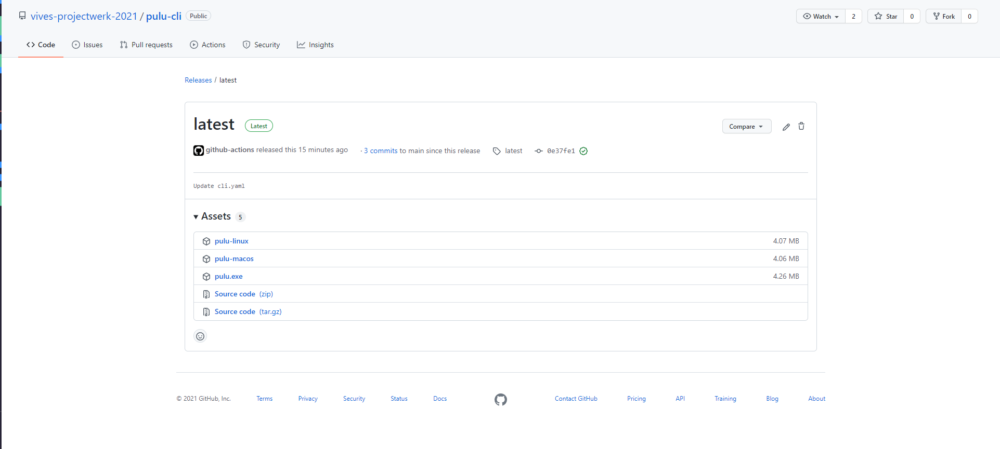
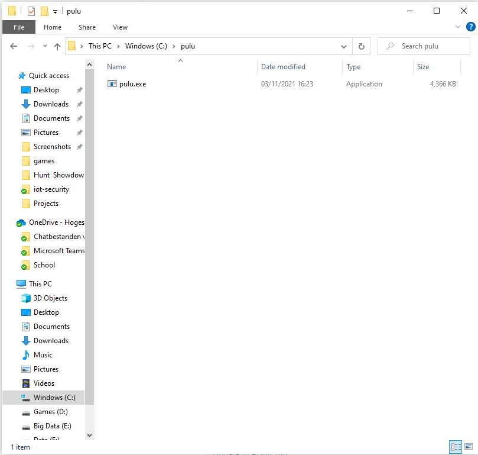
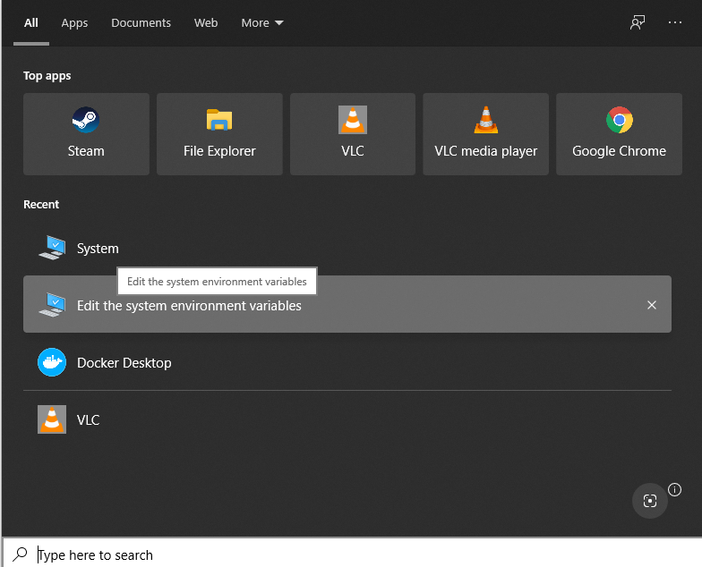
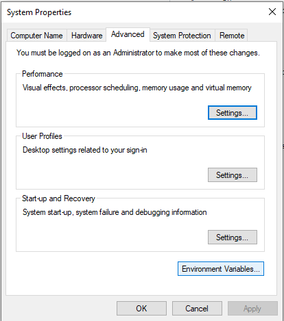
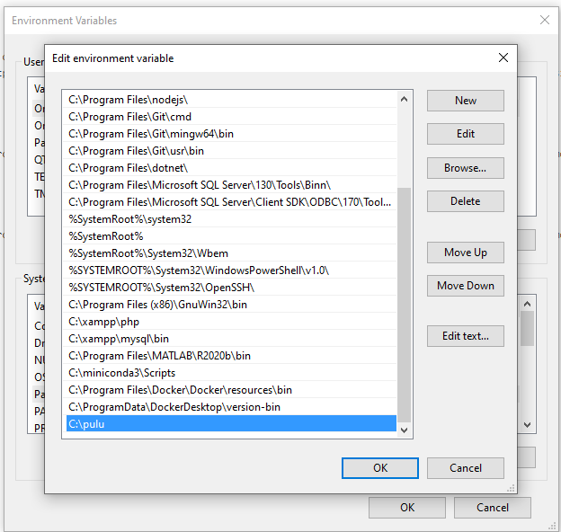

# Pulu CLI

## Usage

### Login

You can easly login into the production or staging servers by running `pulu login [production/staging]` \
When logging in, the [proxy gateway](https://github.com/vives-projectwerk-2021/proxy-gateway) will check if you have the right permissions. (you must be in the devops group)

## Install from release

### Linux

```sh
sudo curl -L https://github.com/vives-projectwerk-2021/pulu-cli/releases/latest/download/pulu-linux -o /usr/local/bin/pulu && sudo chmod +x /usr/local/bin/pulu
```

### MacOS

```sh
sudo curl -L https://github.com/vives-projectwerk-2021/pulu-cli/releases/latest/download/pulu-macos -o /usr/local/bin/pulu && sudo chmod +x /usr/local/bin/pulu
```

### Windows

#### Guide to install the pulu-cli

##### download the pulu executable from github

Download the pulu.exe for windows.



##### make a new folder to put the executable in


##### paste the executable in the folder



##### search for the tab "edit the system environment variables"



##### search for the path variable



##### add a new variable to path



##### check if the pulu-cli works


```bash
(base) PS C:\Users\simon> pulu
pulu is a command line interface for managing the pulu infrastructure.

Usage:
  pulu [command]

Available Commands:
  completion  generate the autocompletion script for the specified shell
  help        Help about any command
  login       login

Flags:
  -h, --help   help for pulu

Use "pulu [command] --help" for more information about a command.
```

## Install from source

```sh
make
```
